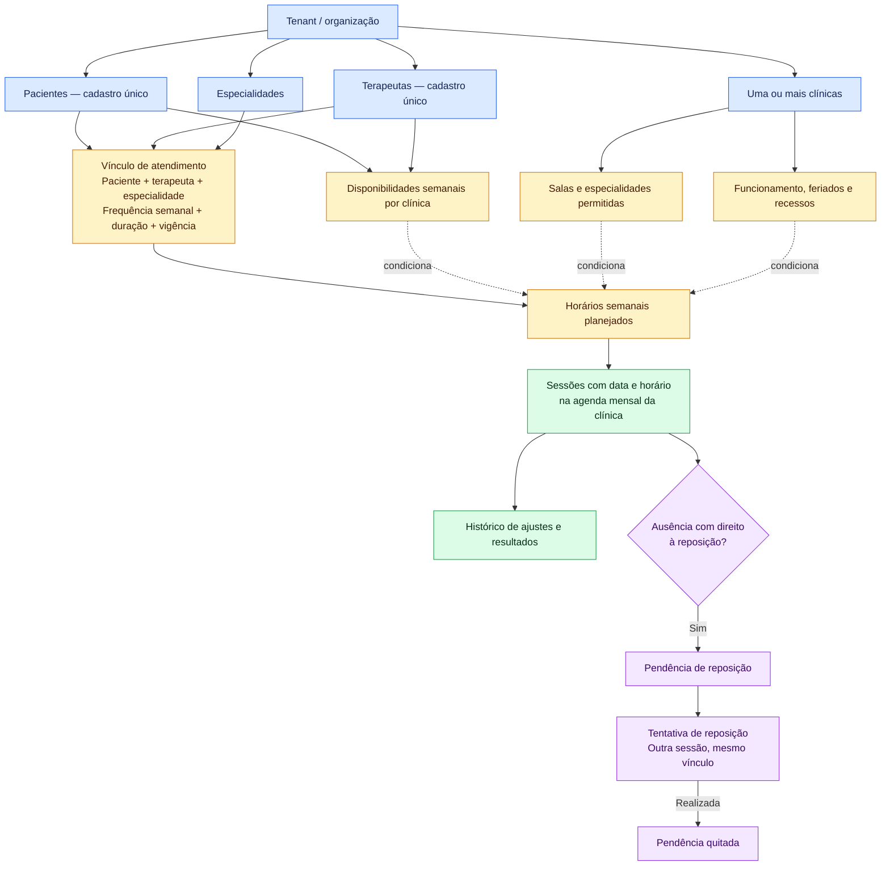
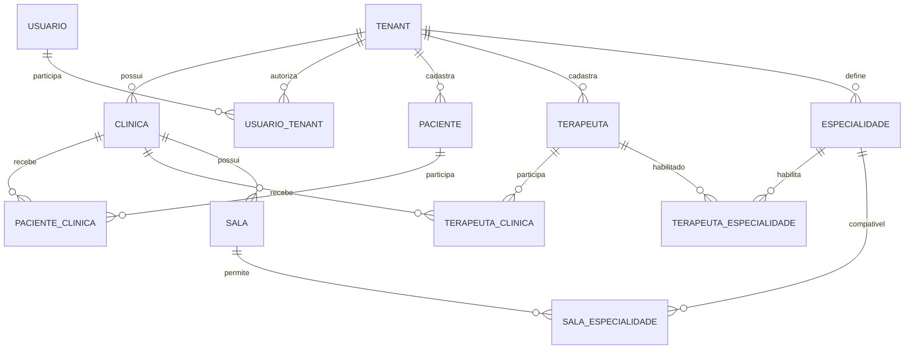
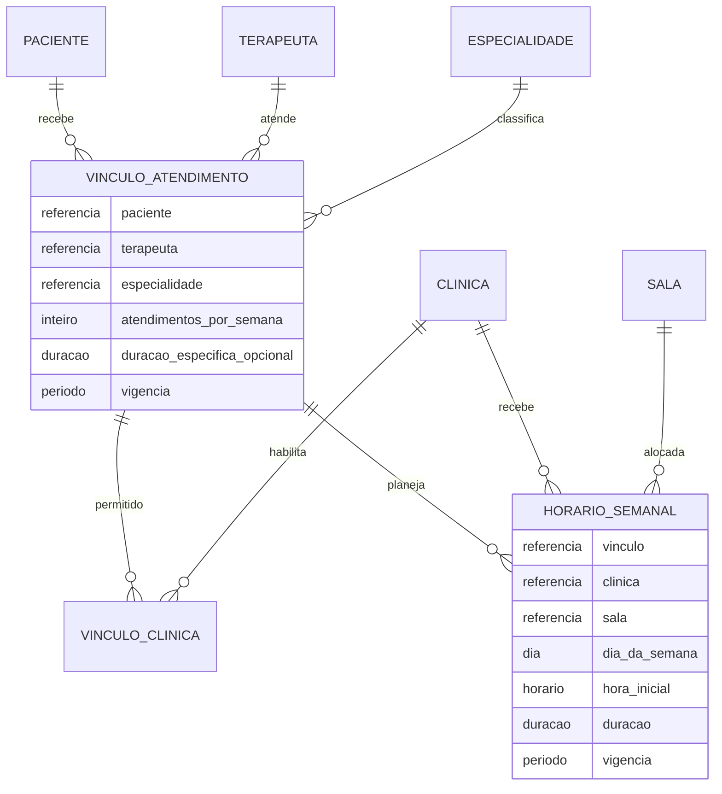
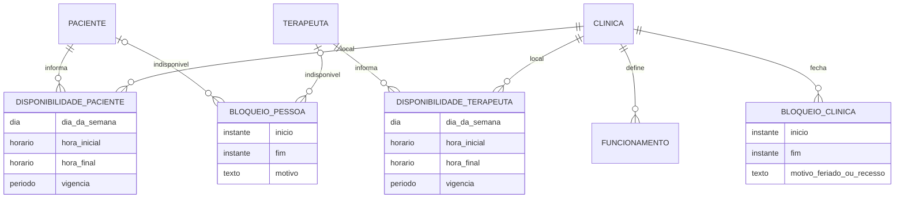
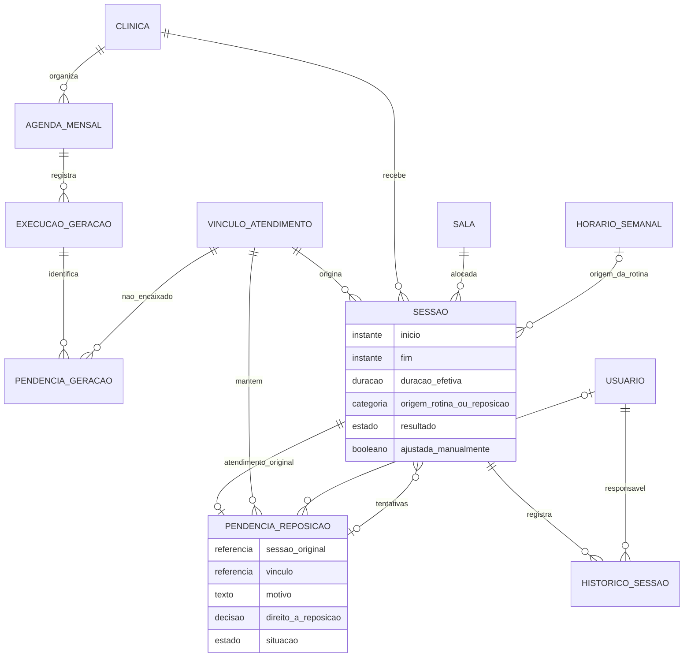
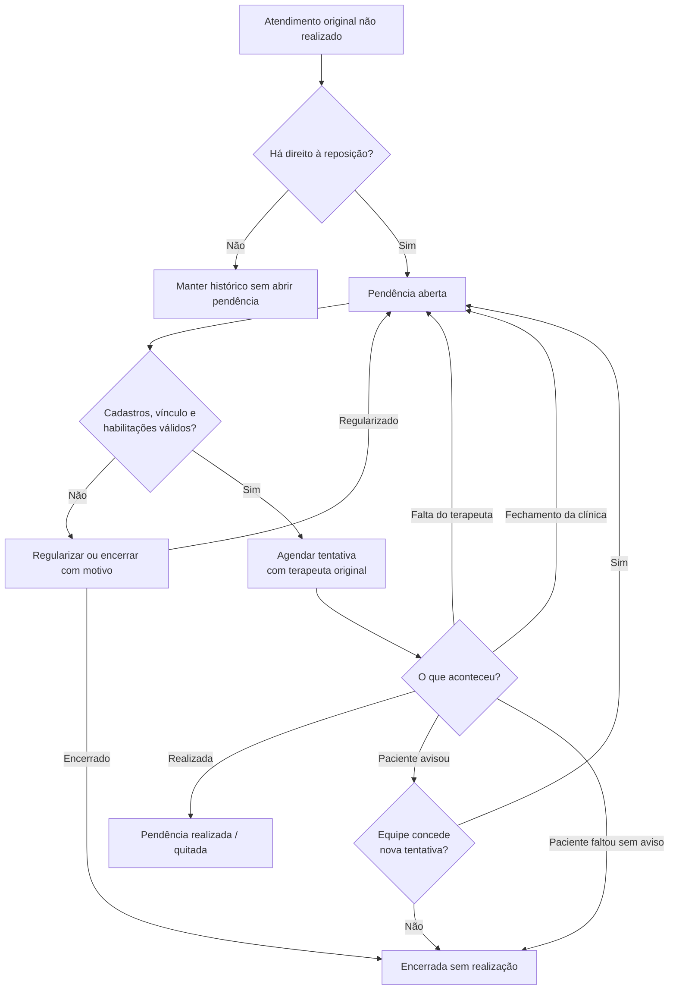

# Diagramas do banco de dados da clínica

Status: diagramas aprovados em 2026-10-09, ainda sem implementação.

Representação visual do [desenho aprovado do banco](../superpowers/specs/2026-10-09-clinic-database-design.md).
Referência funcional: [documentação de negócio](../business/README.md).

Os diagramas são conceituais: os nomes representam entidades, não DDL definitivo.
As visões detalhadas mostram cardinalidades e tabelas associativas. As entidades
repetidas em várias visões representam o mesmo cadastro.

Nos diagramas de entidades: `||` significa exatamente um, `o|` significa zero
ou um e `o{` significa zero ou muitos. Os atributos exibidos são um recorte dos
dados relevantes; seus tipos são conceituais, não tipos SQL definitivos.

## 1. Visão geral

As setas desta visão indicam organização e dependências do domínio, não cardinalidades.

## 2. Organização, acesso e cadastros

- `USUARIO_TENANT` representa o acesso administrativo no MVP.
- `PACIENTE_CLINICA` e `TERAPEUTA_CLINICA` permitem compartilhar cadastros entre unidades.
- `TERAPEUTA_ESPECIALIDADE` e `SALA_ESPECIALIDADE` representam relações muitos-para-muitos.
- As cardinalidades permitem cadastros ainda em configuração. Para agendar, a
  clínica precisa ter os participantes habilitados e uma sala compatível.

## 3. Vínculos e rotina semanal

O vínculo é único por **paciente + terapeuta + especialidade** em cada período
de vigência. Sua frequência é única no tenant, mesmo que distribuída entre clínicas.
A duração específica, quando ausente, usa o padrão da clínica do atendimento.

Um vínculo pode existir sem horários definidos; por isso a relação com
`HORARIO_SEMANAL` permite zero registros. Um horário semanal é o padrão de
repetição, enquanto a disponibilidade é apenas uma janela possível.

## 4. Disponibilidades e calendário

Cada `BLOQUEIO_PESSOA` pertence **a um paciente ou a um terapeuta, nunca aos dois**.
As duas relações opcionais precisam dessa restrição adicional de exclusividade;
o mecanismo físico será definido na implementação. O bloqueio vale em todas as
clínicas do tenant.

O fechamento da clínica impede a geração de sessões. Não cria reposição de
atendimentos habituais nem obriga a completar a frequência em outro dia.

## 5. Agenda, sessões e pendências

- `PENDENCIA_GERACAO`: o gerador não encontrou capacidade; não representa uma dívida.
- `PENDENCIA_REPOSICAO`: um atendimento previsto não aconteceu e há direito a repô-lo.
- A mesma entidade `SESSAO` representa a rotina e as tentativas de reposição.
- Uma sessão pode ter zero ou uma pendência de origem de reposição:
  zero para rotina; exatamente uma para uma tentativa de reposição.
- A relação `atendimento_original` é diferente de `tentativas`: a primeira
  identifica a sessão que gerou o direito; a segunda aponta os novos encaixes.
- Falta em uma tentativa reabre ou encerra a pendência existente conforme a regra;
  não cria uma pendência filha.
- No máximo uma tentativa ativa agendada e uma realizada por pendência.
- A agenda mensal reúne sessões por clínica e mês. A visão não impõe uma FK
  obrigatória de sessão para agenda: ajustes e registros de ausências antecipadas
  precisam existir independentemente de uma execução de geração.
- Responsável pela decisão é opcional quando o direito decorre automaticamente
  da falta do terapeuta; decisões administrativas exigem responsável registrado.

## 6. Ciclo da reposição

## 7. Restrições que acompanham os diagramas

As cardinalidades não expressam todas as regras. A implementação também deve garantir:

- Isolamento por tenant e referências que não misturem organizações.
- Vínculos e participantes habilitados para a clínica escolhida.
- Especialidade habilitada para terapeuta e sala.
- Ausência de sobreposição de paciente, terapeuta ou sala, mesmo entre clínicas.
- Vigências válidas, frequência e duração positivas e início anterior ao fim.
- Identidade da ocorrência original preservada nos ajustes e novas gerações.
- Reposição com o mesmo paciente, terapeuta e especialidade do atendimento original.
- Ausência de duplicação de sessões, pendências e tentativas ativas.
- Encaixe fora da disponibilidade apenas por ajuste manual registrado, sem
  desrespeitar funcionamento, bloqueios ou conflitos.

Os diagramas podem ser visualizados em um renderizador Mermaid, como o GitHub
ou uma prévia Markdown com suporte a Mermaid.
